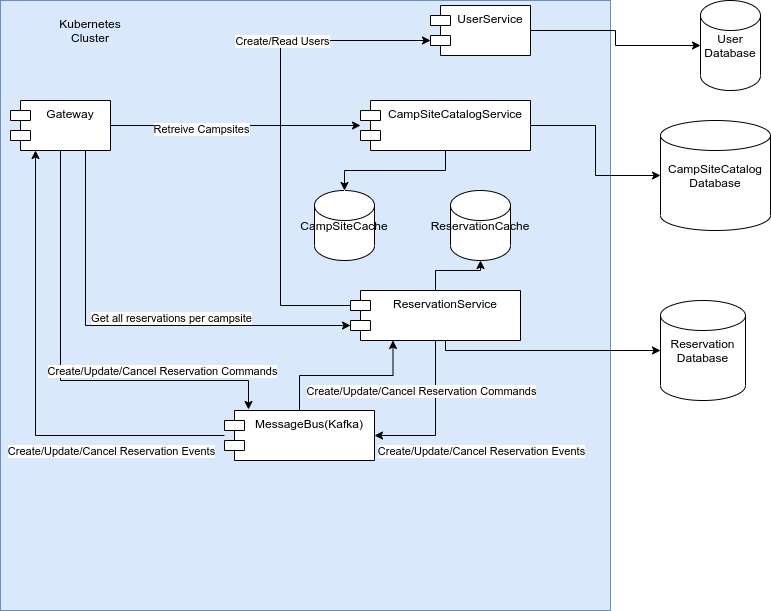
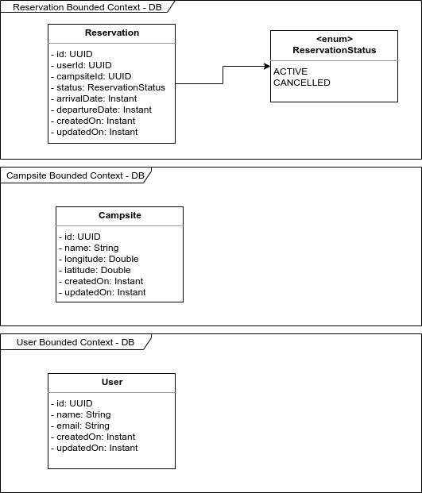

# New Island Booking System

## Back-end Tech Challenge

An underwater volcano formed a new small island in the Pacific Ocean last month. All the conditions on the island seems perfect and it was
decided to open it up for the general public to experience the pristine uncharted territory.
The island is big enough to host a single campsite so everybody is very excited to visit. In order to regulate the number of people on the island, it
was decided to come up with an online web application to manage the reservations. You are responsible for design and development of a REST
API service that will manage the campsite reservations.
To streamline the reservations a few constraints need to be in place -

1. The campsite will be free for all.
2. The campsite can be reserved for max 3 days.
3. The campsite can be reserved minimum 1 day(s) ahead of arrival and up to 1 month in advance.
4. Reservations can be cancelled anytime.
5. For sake of simplicity assume the check-in & check-out time is 12:00 AM

## System Requirements

1. The users will need to find out when the campsite is available. So the system should expose an API to provide information of the
availability of the campsite for a given date range with the default being 1 month.
2. Provide an end point for reserving the campsite. The user will provide his/her email & full name at the time of reserving the campsite
along with intended arrival date and departure date. Return a unique booking identifier back to the caller if the reservation is successful.
3. The unique booking identifier can be used to modify or cancel the reservation later on. Provide appropriate end point(s) to allow
modification/cancellation of an existing reservation
4. Due to the popularity of the island, there is a high likelihood of multiple users attempting to reserve the campsite for the same/overlapping
date(s). Demonstrate with appropriate test cases that the system can gracefully handle concurrent requests to reserve the campsite.
5. Provide appropriate error messages to the caller to indicate the error cases.
6. In general, the system should be able to handle large volume of requests for getting the campsite availability.
7. There are no restrictions on how reservations are stored as as long as system constraints are not violated.

# System Design
This system has been designed choosing high availability (from CAP theorem) using eventual consistency 
to scale all distributed operations but using some concepts to help consistency as well specially at the moment to
create/update/cancel reservations.
## Domain Drive Design
### Bounded Contexts:
* Reservation
* User 
* Campsite Catalog  
## Component Diagram
The following system design has been build following the reactive architecture guidelines
having the reactive manifesto in mind.    

The system is designed to run using a container orchestration system such as kubernetes 
(please see k8s yaml deployment and configurations) to allow a cloud agnostic solution, where all load balancing 
and service discovery will be managed by kubernetes (in the case no kubernetes we can deploy it on compute instances 
as well on any cloud or on-premise using Netflix Eureka) 

The technology stack :
* **Spring Boot**
* **Spring Reactive WebFlux**
* **Spring Data with JPA/Hibernate** 
(I could use Spring Data R2DBC https://spring.io/projects/spring-data-r2dbc 
 but there's only support for a few databases, I assume portability could be an issue, 
 but we can easily adapt it due to the usage of WebFlux and code decoupling)
* **Spring Cache** 
(for simplicity of execution I use the default cache provider, 
but we can set up a distributed cache such as Redis if is need it)
* **Spring Reactive Sockets** 
to provide asynchronous response
* **Apache Kafka as Message Bus** 
to increase responsiveness, elasticity, resilience and message driven  
also allow to have complete decoupling between microservices and 
listening to reservations event we can create data pipeline to an 
OLAP type database (AWS Redshift of Google Big Query)for analytical usages 
## Class Diagram / Database Design
Having in mind separation in state from reactive systems 
all three microservices do not share database therefore each microservice 
has a separate database I have chosen postgres because 
the schema is clearly defined but we don need ACID capabilities 
(since it uses kafka topics partitioning to solve concurrency booking issues) 
that's the reason Cassandra could be a great choice too

## System resource costs calculations
Assuming :
* we have 1 million users daily
* we have 1 million campsites

a single reservation having 
* id 36 bytes
* id userId 36 bytes
* campsite 36 bytes 
* status 9 bytes max
* arrivalDate Timestamp - (8 bytes, little endian	5 bytes + fractional-seconds storage, big endian)
* departureDate Timestamp - (8 bytes, little endian	5 bytes + fractional-seconds storage, big endian)
* createdOn Timestamp - (8 bytes, little endian	5 bytes + fractional-seconds storage, big endian)
* updatedOn Timestamp - (8 bytes, little endian	5 bytes + fractional-seconds storage, big endian)

total = (36*3)+9+(8*4) = 149 bytes
having 1 million users daily creating on average 1 reservation -> 149 bytes * 1M = 0.1388 GB daily = 50 GB yearly 
we might need use database partitioning if we want keep the records. 
Additionally I have designed an on memory cache that will improve this database performance. 

a single user having 
* id 36 bytes
* name 100 bytes
* email 100 bytes
* createdOn Timestamp - (8 bytes, little endian	5 bytes + fractional-seconds storage, big endian)
* updatedOn Timestamp - (8 bytes, little endian	5 bytes + fractional-seconds storage, big endian)

total = 36+(100*2)+(8*2) = 252 bytes -> 252 bytes * 1M = 0.23 GB daily = 85.7 GB yearly
definitely I would recommend having database partitioning for this database.

a single campsite having 
* id 36 bytes
* name 100 bytes
* latitude Double (64 bits) = 8 bytes   
* longitude Double (64 bits) = 8 bytes
* createdOn Timestamp - (8 bytes, little endian	5 bytes + fractional-seconds storage, big endian)
* updatedOn Timestamp - (8 bytes, little endian	5 bytes + fractional-seconds storage, big endian)

total = (8*4)+100+36 = 168 bytes -> 168 bytes * 1M = 0.156 GB 
we can have this store on memory along with disk persisted database, 
since this information does not change too often. 
## Business logic review
1. The campsite will be free for all.
- Data retrieval is open through the gateway 

2. The campsite can be reserved for max 3 days.
- Implemented on 
[reservation-service](reservation-service/src/main/java/com/newisland/reservation/service/ReservationServiceImpl.java)
please also check test cases on [reservation-service tests](reservation-service/src/test/java/com/newisland/reservation/service/ReservationServiceTest.java)     

3. The campsite can be reserved minimum 1 day(s) ahead of arrival and up to 1 month in advance.
- Implemented on 
[reservation-service](reservation-service/src/main/java/com/newisland/reservation/service/ReservationServiceImpl.java)
please also check test cases on [reservation-service tests](reservation-service/src/test/java/com/newisland/reservation/service/ReservationServiceTest.java)     

4. Reservations can be cancelled anytime.
- Implemented on 
[reservation-service](reservation-service/src/main/java/com/newisland/reservation/service/ReservationServiceImpl.java)
please also check test cases on [reservation-service tests](reservation-service/src/test/java/com/newisland/reservation/service/ReservationServiceTest.java)     

5. For sake of simplicity assume the check-in & check-out time is 12:00 AM

## System Requirements

1. The users will need to find out when the campsite is available. So the system should expose an API to provide information of the
availability of the campsite for a given date range with the default being 1 month.

* the reservation service has implemented this query that having the campsite as parameter 
    * GET /reservation/availability/{{campsite_id}}  
    * GET /reservation/availability/{{campsite_id}}/{{startDate}}/{{endDate}} with startDate and endDate as parameters

2. Provide an end point for reserving the campsite. The user will provide his/her email & full name at the time of reserving the campsite
along with intended arrival date and departure date. Return a unique booking identifier back to the caller if the reservation is successful.
    They are two ways to achieve this by web-sockets or with a http call will create the reservation.
* Web Socket:
    * ws://{{gateway-url}}/ws/reservations
        * request:
            {
              "type": "create",
              "userFullName": "Test User",
              "userEmail": "test@test.com",
              "campsiteId": "0aec7e63-e615-41a0-bff2-4fb1fb655a6e",
              "arrivalDate": "2020-10-01T17:52:46+00:00",
              "departureDate": "2020-10-02T17:52:46+00:00"
            }
        * successful response:
            {
              "referenceId": "b1b88c54-f160-4482-b31a-0e2e9302e647",
              "status": "SUCCESS",
              "errorMessage": null
            }            
* Http Post request :
    http://{{gateway-url}}/createReservation
        * request:
                {
                  "type": "create",
                  "userFullName": "Test User",
                  "userEmail": "test@test.com",
                  "campsiteId": "0aec7e63-e615-41a0-bff2-4fb1fb655a6e",
                  "arrivalDate": "2020-10-01T17:52:46+00:00",
                  "departureDate": "2020-10-02T17:52:46+00:00"
                }
        * response will return a status pending confirmation can be implemented either email,
         (java script requesting for updates many times up to update is received) or other similar mechanism.
                
3. The unique booking identifier can be used to modify or cancel the reservation later on. Provide appropriate end point(s) to allow
modification/cancellation of an existing reservation

* Update:
    * Web Socket:
        * ws://{{gateway-url}}/ws/reservations
            * request:
                {
                  "type": "update",
                  "id":"4d762cad-407f-4e45-9571-33effdcbb474",
                  "userFullName": "Test User",
                  "userEmail": "test@test.com",
                  "campsiteId": "0aec7e63-e615-41a0-bff2-4fb1fb655a6e",
                  "arrivalDate": "2020-10-01T17:52:46+00:00",
                  "departureDate": "2020-10-02T17:52:46+00:00"
                }
            * successful response:
                {
                  "referenceId": "b1b88c54-f160-4482-b31a-0e2e9302e647",
                  "status": "SUCCESS",
                  "errorMessage": null
                }            
    * Http Patch request :
        http://{{gateway-url}}/createReservation
            * request:
                    {
                      "type": "update",
                      "id":"4d762cad-407f-4e45-9571-33effdcbb474",
                      "userFullName": "Test User",
                      "userEmail": "test@test.com",
                      "campsiteId": "0aec7e63-e615-41a0-bff2-4fb1fb655a6e",
                      "arrivalDate": "2020-10-01T17:52:46+00:00",
                      "departureDate": "2020-10-02T17:52:46+00:00"
                    }
                    
* Cancel:
    * Web Socket:
        * ws://{{gateway-url}}/ws/reservations
            * request:
                {
                  "type": "cancel",
                  "id":"4d762cad-407f-4e45-9571-33effdcbb474",
                  "campsiteId": "0aec7e63-e615-41a0-bff2-4fb1fb655a6e"
                }
            * successful response:
                {
                  "referenceId": "b1b88c54-f160-4482-b31a-0e2e9302e647",
                  "status": "SUCCESS",
                  "errorMessage": null
                }            
    * Http Delete request :
        http://{{gateway-url}}/createReservation
            * request:
                    {
                      "type": "cancel",
                      "id":"4d762cad-407f-4e45-9571-33effdcbb474",
                      "campsiteId": "0aec7e63-e615-41a0-bff2-4fb1fb655a6e"
                    }                    
4. Due to the popularity of the island, there is a high likelihood of multiple users attempting to reserve the campsite for the same/overlapping
date(s). Demonstrate with appropriate test cases that the system can gracefully handle concurrent requests to reserve the campsite.

The system has been implemented using kafka as message bus 
and the selected key for the message will be campsite id therefore all 
messages that belong to the same key will be processed in order, 
the database can be use as a distributed locking control but will 
impact greatly since kafka can be easier scale than a rdbms database, 
as another measure the system checks if there will be any double booking   

5. Provide appropriate error messages to the caller to indicate the error cases.

The Web socket replies with an error message and a status as a response of any request

6. In general, the system should be able to handle large volume of requests for getting the campsite availability.

On memory cache has been implemented to help the system and database performance, 
also partitioning would help if historic information is kept.   

7. There are no restrictions on how reservations are stored as as long as system constraints are not violated.

    
## Kafka Setup
### Localhost Standalone
https://kafka.apache.org/quickstart
### Kubernetes
https://strimzi.io/quickstarts
### Create Topic for Reservation Commands (Create,Update,Cancel)
bin/kafka-topics.sh --describe --topic reservation-commands --bootstrap-server localhost:9092
### Create Topic for Reservation Events (Created,Updated,Cancelled)
bin/kafka-topics.sh --describe --topic reservation-events --bootstrap-server localhost:9092